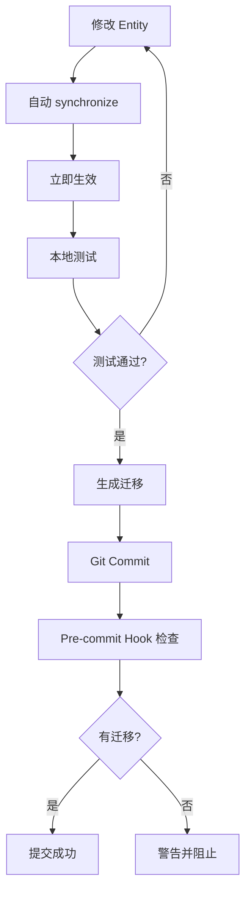
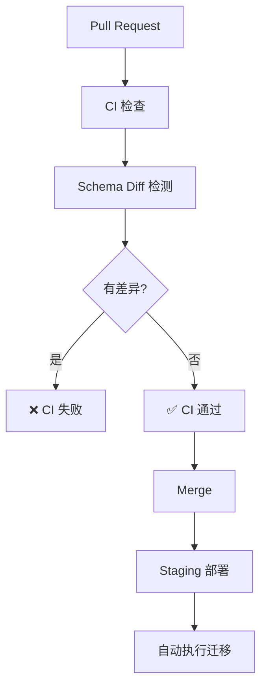

# 数据库字段错误预防方案

## 🎯 问题分析

开发中常见的数据库字段错误:

### 常见错误类型

1. **字段不存在** ❌
   ```
   ERROR: column "phoneNumber" does not exist
   ```
   - 原因: Entity 有字段,但数据库没有
   - 场景: 修改了 Entity,但没执行迁移

2. **类型不匹配** ❌
   ```
   ERROR: column "age" is of type integer but expression is of type text
   ```
   - 原因: 代码类型和数据库类型不一致
   - 场景: 改了 Entity 类型,数据库未更新

3. **字段拼写错误** ❌
   ```
   ERROR: column "usrname" does not exist
   Hint: Perhaps you mean to reference column "username"
   ```
   - 原因: 代码中字段名拼写错误
   - 场景: 手写 SQL 或 QueryBuilder

4. **关系错误** ❌
   ```
   ERROR: relation "user_profiles" does not exist
   ```
   - 原因: 表不存在或关系配置错误
   - 场景: @ManyToOne/@OneToMany 配置问题

---

## ✅ 解决方案

### 方案1: 自动同步开发环境 (推荐用于开发)

#### 配置分环境同步

```typescript
// backend/user-service/src/app.module.ts
import { Module } from '@nestjs/common';
import { TypeOrmModule } from '@nestjs/typeorm';
import { ConfigModule, ConfigService } from '@nestjs/config';

@Module({
  imports: [
    ConfigModule.forRoot({
      isGlobal: true,
      envFilePath: `.env.${process.env.NODE_ENV || 'development'}`,
    }),
    TypeOrmModule.forRootAsync({
      inject: [ConfigService],
      useFactory: (configService: ConfigService) => {
        const isProduction = configService.get('NODE_ENV') === 'production';
        const isTest = configService.get('NODE_ENV') === 'test';

        return {
          type: 'postgres',
          host: configService.get('DB_HOST'),
          port: configService.get('DB_PORT'),
          username: configService.get('DB_USERNAME'),
          password: configService.get('DB_PASSWORD'),
          database: configService.get('DB_DATABASE'),
          entities: [__dirname + '/**/*.entity{.ts,.js}'],

          // 🔑 关键配置
          synchronize: !isProduction,  // 开发环境自动同步,生产环境禁用
          migrationsRun: isProduction, // 生产环境自动运行迁移

          logging: isProduction ? ['error', 'warn'] : ['query', 'error', 'warn'],
        };
      },
    }),
  ],
})
export class AppModule {}
```

#### 环境变量配置

```bash
# .env.development (开发环境)
NODE_ENV=development
DB_HOST=localhost
DB_PORT=5432
DB_USERNAME=postgres
DB_PASSWORD=postgres
DB_DATABASE=cloudphone_user

# .env.production (生产环境)
NODE_ENV=production
DB_HOST=production-db.example.com
DB_PORT=5432
DB_USERNAME=cloudphone
DB_PASSWORD=***
DB_DATABASE=cloudphone_user
```

**优点:**
- ✅ 修改 Entity 立即生效
- ✅ 不用手动执行迁移
- ✅ 开发速度快

**缺点:**
- ⚠️ 可能覆盖数据
- ⚠️ 不适合团队协作

---

### 方案2: 自动生成和检查迁移 (推荐用于团队)

#### 2.1 Git Pre-commit Hook 自动检查

创建 `.husky/pre-commit`:

```bash
#!/bin/sh
. "$(dirname "$0")/_/husky.sh"

echo "🔍 检查数据库迁移..."

# 检查是否有未提交的 Entity 变更
ENTITY_CHANGED=$(git diff --cached --name-only | grep "\.entity\.ts$")

if [ -n "$ENTITY_CHANGED" ]; then
  echo "📝 检测到 Entity 变更:"
  echo "$ENTITY_CHANGED"

  # 检查是否有对应的迁移
  MIGRATION_CHANGED=$(git diff --cached --name-only | grep "migrations/.*\.ts$")

  if [ -z "$MIGRATION_CHANGED" ]; then
    echo "⚠️  警告: Entity 有变更但没有迁移文件!"
    echo ""
    echo "请执行以下命令生成迁移:"
    echo "  cd backend/[service-name]"
    echo "  pnpm migration:generate src/migrations/YourChanges"
    echo ""
    read -p "是否继续提交? (y/n) " -n 1 -r
    echo
    if [[ ! $REPLY =~ ^[Yy]$ ]]; then
      exit 1
    fi
  else
    echo "✅ 检测到迁移文件"
  fi
fi

echo "✅ 检查完成"
```

安装 husky:

```bash
pnpm add -D husky

# 初始化
pnpm exec husky install

# 创建 pre-commit hook
pnpm exec husky add .husky/pre-commit "chmod +x .husky/pre-commit"
```

#### 2.2 开发流程规范

```bash
# 1. 修改 Entity
# src/entities/user.entity.ts
@Entity('users')
export class User {
  @Column({ type: 'varchar', length: 20, nullable: true })
  phoneNumber: string;  // 新增字段
}

# 2. 立即生成迁移
pnpm migration:generate src/migrations/AddPhoneNumber

# 3. 检查生成的迁移
cat src/migrations/*-AddPhoneNumber.ts

# 4. 执行迁移(更新本地数据库)
pnpm migration:run

# 5. 测试
pnpm test

# 6. 提交 (Git hook 会自动检查)
git add .
git commit -m "feat(user): add phone number field"
```

---

### 方案3: 开发辅助工具

#### 3.1 TypeORM Entity 验证脚本

创建 `scripts/validate-entities.ts`:

```typescript
import { DataSource } from 'typeorm';
import { User } from '../backend/user-service/src/entities/user.entity';

async function validateEntities() {
  const dataSource = new DataSource({
    type: 'postgres',
    host: 'localhost',
    port: 5432,
    username: 'postgres',
    password: 'postgres',
    database: 'cloudphone_user',
    entities: [User],
    synchronize: false,
  });

  try {
    await dataSource.initialize();
    console.log('✅ 数据库连接成功');

    // 获取数据库实际的表结构
    const queryRunner = dataSource.createQueryRunner();
    const table = await queryRunner.getTable('users');

    if (!table) {
      console.error('❌ 表 users 不存在');
      process.exit(1);
    }

    // 获取 Entity 定义的字段
    const entityMetadata = dataSource.getMetadata(User);
    const entityColumns = entityMetadata.columns.map(col => col.propertyName);

    // 对比
    console.log('\n📊 字段对比:');
    console.log('Entity 字段:', entityColumns);
    console.log('数据库字段:', table.columns.map(col => col.name));

    // 检查缺失字段
    const dbColumnNames = table.columns.map(col => col.name);
    const missingInDb = entityColumns.filter(col => !dbColumnNames.includes(col));
    const missingInEntity = dbColumnNames.filter(col => !entityColumns.includes(col));

    if (missingInDb.length > 0) {
      console.error('\n❌ Entity 中有但数据库缺失的字段:');
      missingInDb.forEach(col => console.error(`   - ${col}`));
      console.error('\n💡 请执行: pnpm migration:generate src/migrations/AddMissingFields');
    }

    if (missingInEntity.length > 0) {
      console.warn('\n⚠️  数据库中有但 Entity 缺失的字段:');
      missingInEntity.forEach(col => console.warn(`   - ${col}`));
    }

    if (missingInDb.length === 0 && missingInEntity.length === 0) {
      console.log('\n✅ Entity 和数据库字段完全一致!');
    }

    await queryRunner.release();
    await dataSource.destroy();
  } catch (error) {
    console.error('❌ 验证失败:', error.message);
    process.exit(1);
  }
}

validateEntities();
```

添加到 package.json:

```json
{
  "scripts": {
    "validate:entities": "ts-node scripts/validate-entities.ts"
  }
}
```

使用:

```bash
pnpm validate:entities
```

#### 3.2 VSCode 扩展推荐

安装以下扩展:

1. **TypeORM** - Entity 智能提示
2. **PostgreSQL** - 数据库管理和查询
3. **Database Client** - 可视化数据库浏览

配置 `.vscode/settings.json`:

```json
{
  "typescript.suggest.autoImports": true,
  "typescript.updateImportsOnFileMove.enabled": "always",
  "database-client.telemetry.usesOnlineServices": false,
  "database-client.autoSync": false
}
```

---

### 方案4: 数据库Schema监控

#### 4.1 Schema 差异检测

创建 `scripts/check-schema-diff.sh`:

```bash
#!/bin/bash

# 检查 Entity 和数据库的差异

set -e

SERVICES=("user-service" "device-service" "app-service" "billing-service" "notification-service")

echo "🔍 检查所有服务的 Schema 差异"
echo ""

HAS_DIFF=0

for service in "${SERVICES[@]}"; do
  echo "━━━━━━━━━━━━━━━━━━━━━━━━━━━━━━━━"
  echo "检查服务: $service"
  echo "━━━━━━━━━━━━━━━━━━━━━━━━━━━━━━━━"

  cd "backend/$service"

  # 尝试生成迁移(dry-run)
  OUTPUT=$(pnpm migration:generate src/migrations/SchemaDiff 2>&1 || true)

  if echo "$OUTPUT" | grep -q "No changes in database schema were found"; then
    echo "✅ 无差异"
  else
    echo "⚠️  发现差异!"
    echo "$OUTPUT" | grep -A 5 "Migration.*has been generated"
    HAS_DIFF=1

    # 删除生成的临时迁移
    rm -f src/migrations/*-SchemaDiff.ts
  fi

  cd ../..
  echo ""
done

if [ $HAS_DIFF -eq 1 ]; then
  echo "━━━━━━━━━━━━━━━━━━━━━━━━━━━━━━━━"
  echo "⚠️  发现 Schema 差异,请生成迁移!"
  echo "━━━━━━━━━━━━━━━━━━━━━━━━━━━━━━━━"
  exit 1
else
  echo "━━━━━━━━━━━━━━━━━━━━━━━━━━━━━━━━"
  echo "✅ 所有服务 Schema 一致"
  echo "━━━━━━━━━━━━━━━━━━━━━━━━━━━━━━━━"
fi
```

添加到 CI:

```yaml
# .github/workflows/ci.yml
name: CI

on: [push, pull_request]

jobs:
  test:
    runs-on: ubuntu-latest
    steps:
      - uses: actions/checkout@v3

      - name: Check Schema Diff
        run: ./scripts/check-schema-diff.sh
```

---

### 方案5: 类型安全的查询构建

#### 5.1 使用 QueryBuilder 而不是原始 SQL

```typescript
// ❌ 不安全: 原始 SQL
const users = await this.userRepository.query(`
  SELECT * FROM users WHERE usrname = $1
`);  // 拼写错误: usrname

// ✅ 安全: QueryBuilder (有类型检查)
const users = await this.userRepository
  .createQueryBuilder('user')
  .where('user.username = :username', { username: 'john' })  // ✅ 自动补全,类型检查
  .getMany();

// ✅ 更安全: find 方法
const users = await this.userRepository.find({
  where: { username: 'john' },  // ✅ TypeScript 检查字段名
});
```

#### 5.2 创建类型安全的查询帮助函数

```typescript
// src/common/utils/query-helper.ts
import { Repository, FindOptionsWhere } from 'typeorm';
import { User } from '../entities/user.entity';

export class TypeSafeQuery {
  /**
   * 类型安全的查询
   * 使用 TypeScript 的类型系统确保字段存在
   */
  static async findByFields<T>(
    repository: Repository<T>,
    fields: Partial<T>
  ): Promise<T[]> {
    return repository.find({
      where: fields as FindOptionsWhere<T>,
    });
  }
}

// 使用
const users = await TypeSafeQuery.findByFields(this.userRepository, {
  username: 'john',  // ✅ TypeScript 会检查 username 是否存在
  phoneNumber: '123',  // ✅ 自动补全
  // invalidField: 'x',  // ❌ 编译错误: Property 'invalidField' does not exist
});
```

---

## 🛡️ 完整防护方案 (推荐组合)

### 本地开发环境



### 团队协作环境



### 配置文件

#### 1. package.json

```json
{
  "scripts": {
    "dev": "nest start --watch",
    "migration:generate": "npm run typeorm -- migration:generate -d src/config/typeorm-cli.config.ts",
    "migration:run": "npm run typeorm -- migration:run -d src/config/typeorm-cli.config.ts",
    "migration:check": "npm run migration:generate src/migrations/TempCheck && rm -f src/migrations/*-TempCheck.ts",
    "validate:entities": "ts-node scripts/validate-entities.ts",
    "precommit": "npm run migration:check"
  },
  "husky": {
    "hooks": {
      "pre-commit": "npm run precommit"
    }
  }
}
```

#### 2. 开发环境配置

```typescript
// src/config/typeorm.config.ts
export const createTypeOrmConfig = (configService: ConfigService) => {
  const env = configService.get('NODE_ENV');

  // 开发环境配置
  if (env === 'development') {
    return {
      // ...其他配置
      synchronize: true,  // ✅ 自动同步
      logging: ['query', 'error', 'schema'],  // ✅ 显示 Schema 变更日志
      dropSchema: false,  // ⚠️ 不删除Schema
    };
  }

  // 生产环境配置
  if (env === 'production') {
    return {
      // ...其他配置
      synchronize: false,  // ❌ 禁用自动同步
      migrationsRun: true,  // ✅ 自动运行迁移
      logging: ['error', 'warn', 'migration'],
    };
  }

  // 测试环境配置
  return {
    // ...其他配置
    synchronize: true,  // ✅ 测试环境自动同步
    dropSchema: true,  // ✅ 每次测试前清空
  };
};
```

---

## 🎯 最佳实践总结

### 开发阶段

1. ✅ **使用 synchronize: true** (仅开发环境)
2. ✅ **频繁测试** - 每次改 Entity 后立即测试
3. ✅ **生成迁移** - 功能完成后生成迁移
4. ✅ **提交前检查** - Git hook 自动检查

### 团队协作

1. ✅ **统一环境配置** - .env.example 模板
2. ✅ **Code Review** - 检查迁移文件
3. ✅ **CI 检查** - 自动检测 Schema 差异
4. ✅ **文档更新** - 重大变更记录文档

### 生产部署

1. ❌ **禁用 synchronize**
2. ✅ **自动运行迁移** - migrationsRun: true
3. ✅ **备份数据库** - 部署前备份
4. ✅ **回滚方案** - 准备回滚脚本

---

## 📦 快速安装脚本

创建 `scripts/setup-field-validation.sh`:

```bash
#!/bin/bash

echo "🔧 安装数据库字段错误预防工具"

# 1. 安装 husky
pnpm add -D husky
pnpm exec husky install

# 2. 创建 pre-commit hook
cat > .husky/pre-commit << 'EOF'
#!/bin/sh
. "$(dirname "$0")/_/husky.sh"

echo "🔍 检查数据库迁移..."
ENTITY_CHANGED=$(git diff --cached --name-only | grep "\.entity\.ts$")
if [ -n "$ENTITY_CHANGED" ]; then
  MIGRATION_CHANGED=$(git diff --cached --name-only | grep "migrations/.*\.ts$")
  if [ -z "$MIGRATION_CHANGED" ]; then
    echo "⚠️  Entity 有变更但没有迁移文件!"
    exit 1
  fi
fi
EOF

chmod +x .husky/pre-commit

# 3. 创建验证脚本
mkdir -p scripts
cat > scripts/validate-entities.ts << 'EOF'
// ... (之前的验证脚本代码)
EOF

# 4. 创建 Schema 差异检测脚本
cat > scripts/check-schema-diff.sh << 'EOF'
// ... (之前的差异检测代码)
EOF

chmod +x scripts/check-schema-diff.sh

echo "✅ 安装完成!"
echo ""
echo "下一步:"
echo "  1. 配置 .env.development 和 .env.production"
echo "  2. 运行 pnpm validate:entities 测试"
echo "  3. 尝试修改一个 Entity 并提交"
```

---

## 🎓 培训材料

### 开发者检查清单

每次修改 Entity 时:

- [ ] Entity 字段类型正确?
- [ ] 添加了必要的装饰器? (@Column, @ManyToOne 等)
- [ ] 在开发环境测试通过?
- [ ] 生成了迁移文件?
- [ ] 迁移文件有 up() 和 down()?
- [ ] 提交前运行了验证?

### 常见错误及解决方案

| 错误 | 原因 | 解决方案 |
|------|------|----------|
| column does not exist | Entity 有字段,DB无 | 执行迁移或开启 synchronize |
| type mismatch | 类型不一致 | 更新 Entity 类型并生成迁移 |
| relation does not exist | 表不存在 | 检查 @Entity 名称和关系配置 |
| constraint violation | 违反约束 | 检查 nullable, unique 等配置 |

---

**推荐配置**: 开发环境 synchronize: true + 提交前生成迁移
**工具组合**: Git hooks + Schema 验证 + CI 检查

需要我帮你安装和配置这些工具吗?
